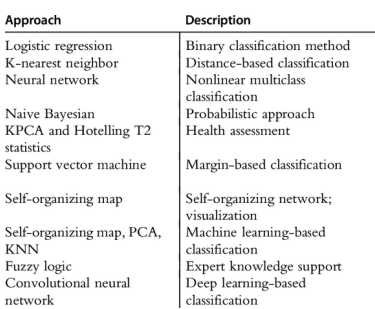
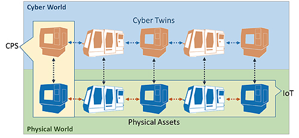

# 인공지능 응용
## 개요

(4차 산업혁명) 산업의 전반은 정보의 고도화를 통해, DX를 넘어 AX를 가능케한다.    
따라서 인공지능을 효율적으로 사용하기 위해 기본적인 스마트 팩토리, 제조, 산업, 이미지 처리 등에 대한 개념을 기록한다.    
스마트 팩토리, 자율주행, 로보틱스 등 인공지능을 사용할 수 있는 범위 및 수단은 점차 진화할 것이다. 이에 대한 기본적인 개념을 잡아보자.
## 제조
### 생산
- 생산이란 유/무형의 새로운 것을 만드는 것
- 원시 산업 (농/광/임업) $$\rightarrow$$ 2차 산업(제조의 시작/시장 생산) $$\rightarrow$$ 3차 산업(서비스 산업/ 생산은 효용의 창조)
- 부가가치: 새로운 가치 창조
  - 기업의 사명으로서 경쟁령 있는 부가가치 창출/일터 제공
- **제조**는 생산의 산출물이 유형물인 것
- 제조란 원재료를 가장 우수하고(품질), 가장 저렴한 방법을 통해(가격) 가장 빠르게(시간) 유용한 제품으로 변환시키는 것.
  - Quality: 기능과 품질
  - Cost: 생산비와 가격
  - Delivery: 생산량과 적기 배달
- 공급 과잉시대에서 제조는 경쟁력 있는 우수한 제품(QCD)을 만들기 위한 적절한 제조방법을 강구해야함
- 제조의 3가지 흐름
  - 재료의 흐름
  - 정보의 흐름
  - 비용의 흐름
- 제조의 중요성
  - 인간존재의 기본적 수단
  - 국가의 부를 창조
- 생산성: 생산공정에서 투입물인 생산요소를 산출물인 생산재로 얼마나 효과적으로 변환하는지
- 경쟁력 있는 생산을 위한 개념
  1. 생산 흐름(쥐틀의 법칙)
  2. 제품 수명주기
- 6 Sigma: 고객의 만족/ 불량률 0에 수렴
  - 산포를 줄인다: 공정 능력 향상
  - 공차를 넓힌다: 설계 능력 향상
  - 중심값 이동: 부품, 설비 등 신규 투자
  - 6 Sigma의 절차
  1. 정의
  2. 측정
  3. 분석
  4. 개선
  5. 관리
- **품질**: 고객의 욕구를 만족시키는 것
- 기업의 목적
  - 전통 기업의 목적: 이윤 추구
  - 새로운 개념: 고객 창출(피터 드러커)
- 품질을 비용 개념으로 표현하여 품질 계획을 수립하고, 품질을 관리하며 품질을 개선해야한다.
- 저품질 비용 혹은 실패비용(COPQ)을 최소화하는 것이 효과적인 기업 경영
### 제조 원가
원가혁신사례 (주요기업의 비용절감 노력 사례)
1. 인력 감축
2. 사업/자산 매각 및 공장 폐쇄
3. 감산, 조업 단축
4. 투자 축소 및 연기
5. 기타(연봉 삭감, 복지 축소, 경비 절약) 

#### 원가의 구성
1. 제조 직접비
   1. 직접 경비
   2. 직접 노무비
   3. 직접 재료비
2. 공장 비용(R&D)
   1. 간접 경비
   2. 간접 노무비
   3. 간접 재료비
3. 영업비
   1. 판매비
   2. 일반 관리비
4. 이익 (판매 가격 - 총 원가)
5. 판매 가격

- 4.에서 총 원가란, 1.~3.을 모두 포함하는 금액을 의미함 
- 1.과 2.를 통틀어 제조원가라 정의함
- 재료비는 약 원가의 50%, 노무비는 약 원가의 15~20%, 제조 이익은 약 15%가 기본적인 기계 산업의 원가 구성    

#### 원가 분류
1. 자본 비용: 건물/ 설비/ 대지면적 등으로 인한 감가상각, 자본 비용
2. 공정 비용: 공장이 가동되고 있는 한 발생하는 가동 비용

또는 다음과 같이 나눌 수 있다.
1. 고정 비용: 생산량과 독립으로 지출되는 비용 공학적인 측면에서의 비용 (첨단 기술과 연구개발비용) 경영과 행정비용 (임원직 임금, 법률 비용), 홍보와 영업비용
2. 변동 비용: 생산량과 종속적으로 지출되는 비용 노무비 (생산관리 감독 포함), 자재비용, 에너지 비용 (전기,가스,기름연료)

#### 원가 설계
- 주어진 제품에 대한 벤치마킹으로 제조원가를 추정하여 목표비용을 설정해, 설계를 시작하는 것
- 경쟁사 제품의 가격과 같거나 조금 싼 합리적인 가격의 제품을 만들기 위한 설계법
#### 이익 계산
운영이익 = 판매 – 생산비용 – (판매지출 + 일반적인 관리 지출)  
현재이익 = 운영이익 + 비 운영 이익 – 비 운영 지출     
부문 이익 (departmental profit) = 부문 판매 – 부문 지출     
생산 마진 이익 = 생산품에 의한 판매 – 생산품에 의한 변동 비용   
생산품에 의한 이익 = 생산 마진 이익 – 생산품에 사용된 고정 비용  
생산품에 의한 운영 이익 = 생산품에 의한 이익 – 생산품에 할당된 일반 지출     
#### 자본 회수
이익은 투자된 자본의 사용에 의하여 얻어짐     
투자자본 회수율 혹은 ‘ROI’는 이익을 얻기 위해서 투자된 자본의 효율 (return on investment)     

## 산업
### Process
**Process in Product manufacturing**    
1. Supplier
   1. SCM (Supply Chain Management)
      - 기업 간에 존재하는 불합리한 낭비요소를 제거하고, 최저비용으로 고객이 요구하는 서비스 수준을 맞추어 제공함으로써 기업의 가치를 극대화하는 활동. 
      - 원재료->중간재->제품 생산->최종 소비자까지 모든 제품과 정보의 흐름이 원활하고 효율적으로 수행할 수 있게 기업 간 또는 지역 간 경계를 극복하고 통합하여 일관되게 관리하고 전체를 최적화하는 것이다. 
      - 이를 실현하기 위한 기반기술로는 QR, ECR, 바코드, POS, EDI, 전자메일, 전자자금결제 시스템 등이 있다.
      - 유통 납기 확인
      - 입고 관리
      - 협력사 관리
      - Reference information management
      - Outgoing order management
      - Supply order management
      - APS(Advanced planning and scheduling)
      - SC stock management
      - Partner & SC development management
2. Design/ Development
   1. PLM(Product Life cycle management) 제품주기관리시스템
      - 제품에 관한 정보를 제품의 기획단계에서부터 설계-개발 -> 생산 -> 판매 -> 폐기에 이르기까지 제품의 라이프 사이클 전체를 관리하는 기법. 
      - 산업이 고객 중심으로 전환되고, 제품 라이프 사이클이 감소하며, 설계-개발 기간이 축소됨에 따라 해당 시스템의 중요성이 도드라지고 있다.
      - PLM을 통해 기업은 고객의 요구사항을 데이터화하고, 관련된 업무에 활용함으로써 적정한 시기에 제품이 시장에 출시될 수 있도록 한다.
      - 제품의 품질은 1:10:100의 원리(손실비용의 크기: 설계단계 1, 생산단계 10, 출하단계 100)이기에, 제품의 라이프 사이클을 관리하는 것은 기업 수익 향상 관점에서도 필수적이다
      - 설계 데이터
      - 설계 이력
      - 협업 관리
      - Reference information management
      - Design automation management
      - Design change management
      - Project management
      - Process planning and development management
      - Factory & line planning management
3. Manufacturing/Quality
   1. ERP (Enterprise resource planning) 전사적 자원 관리
      - 산업의 발달 -> 업무 기능 영역별 전산화 도입 -> 각기 상이한 시스템으로 인한 이중 작업, 비능률적인 요소 다수 발견 -> ERP의 도입(전 부문의 경영자원을 하나의 통합시스템으로 재구축)
      - 경영/실적 관리
      - 인사 관리
      - 재고 관리
      - Sales management
      - MRP(Material Requirement Planning: 자재소요계획)
      - MRP 1: 1960년대 초 등장, 1970년 도입된 자재관리시스템. 재고 감소 목적으로 자재소요량을 계획하고 관리하기 위한 단순한 정보시스템. 구체적 자재조달계획과 생산일정을 관리하는 관리기법
      - MRP 2: 1980년대 등장. 제조 관련 부문의 전체적 최적화를 통해 효율적으로 자재를 관리할수 있도록 한 것. 스케일링 알고리즘, 시뮬레이션 등 생산활동분석기능을 강화하며 지능적제조관리 기법으로 발전. 오늘날 스마트제조의 MES(Manufacturing Execution System)에 해당. 제조프로세스의 최적화 관리로 생산성 향상에 목적을 두고 있다
      - ERP 소프트웨어 도입이 바람직한 것은 맞으나, 시스템 도입비용이 비쌀 뿐 만 아니라 충실하고 정확한 기초정보를 필요로 한다. 
      - 기업 내 조직에 적합하게 구현되기보다는 주어진 패키지에 조직이 맞추는 행태는 실패의 원인이 되기도 했다. 또한, ERP, MES, PLM 등을 각각 개별적으로 도입한 경우 역시 상호 연동 문제로 전체 시스템을 재구축하는 경우가 발생할 수 있다. 
      - 따라서, 스마트제조를 성공적으로 구현하기 위해서는 소프트웨어의 단계적 도입이 바람직하다.
   2. MES (Manufacturing Execution System)
        - ERP의 성공적 구축을 위해서는 생산의 기초정보(납기, 유연성, 원가, 품질, 생산성)에 대한 정확성이 필수적이다. 이때, MES는 다른 소프트웨어를 도입하는 기초 정보 역할을 한다.
        - 자재 관리
        - 작업 계획 지시 
        - 품질 관리 
        - 생산 모니터링 
        - 공정 관리
        - 데이터 수집 등
   3. SCADA (Supervisory Control and data acquisition)
   4. FEMS(Factory Energy Management System: 공장에너지관리시스템)
        - 생산활동 및 시설유지에 사용되는 에너지를 모니터링, 분석, 원격 제어하여 에너지를 효율적으로 사용하기 위한 에너지관리시스템. 
        - 에너지 사용 효율화와 설비, 장비 등의 종합 라이프 사이클 관리를 가능케 한다. 
        - 에너지를 기반으로 하는 제조업 생산시설에 적용될 필요가 있다.
        - 생산스케줄 관리와 설비 제어 자동화 지원 뿐만 아니라, 스마트그리드 연계를 통한 에너지통합관리시스템을 궁극적으로 목표로 하므로, MES 구축 시 FEMS를 함께 구축하는 것이 좋다
4. Delivery
5. Customer
   1. CRM (Customer relation management)
      - 고객에 대한 이해를 바탕으로 고객의 요구를 지속적으로 충족시켜 고객을 오래 유지시키고, 결과적으로 고객의 평생가치를 극대화시켜 수익성을 높이는 시스템. 
      - 고객 데이터를 통합하고 분석한 결과를 다양한 고객 접점부서로 분배하여 활용하는 방식으로 이루어진다. 
      - CRM은 기업마다 마케팅 환경과 내부 업무의 특성이 다르기에 기업 내에서 수행하는 기능을 중심으로 구축하면 된다.
      - Customer analysis 
      - Campaign management
      - Customer contact
      - Customer information
      - Consulting and integration

### 재무제표
1. 대차대조표 (Balance sheet)
2. 손익계산서
3. 현금 흐름도
4. 이익잉여금 처분 계산서
5. 자본 변동표
#### 재무제표란
- 재무회계의 목적: 정보이용자들의 의사결정에 유용한 정보를 제공하는 것.     
- 일반목적의 재무제표 작성 공시
- 재무제표분석을 통하여 특정 기업에 대한 정보를 얻고 평가
- 공시된 재무제표와 추가적인 자료 (예:주식가격,경제지표)를 분석하여 이들 자료상의 수치들의 변화와 관계를 밝히고 정보이용자가 의사결정을 하는데 필요로하는 정보를 제공
- 분석기법: 추세분석, 구성비율분석, 재무비율분석
  - 과거 및 현재의 재무상태와 경영성과를 평가. 미래상황을 예측
1. 추세분석:일정기간 동안의 재무제표 자료의 변화의 방향과 크기를 분석하는 기법.
2. 구성비율분석: 기본이 되는 항목을 100%로 하고, 이에 대하여 다른 항목의 상대적 비율을 표시하는 재무제표를 분석하는 기법
   1. 재무제표를 백분비 재무제표 / 공통형 재무제표
   2. 영업활동에서 각 구성요소들이 차지하는 상대적 중요성을 비교하는데 유용
   3. 기업간 비료 및 기간별 비교가 수월
3. **재무비율분석**
   1. 재무제표 구성항목들간의 관련성을 상호비율을 통한 분석 기법
   2. 표준이 되는 다른 비율 있어야 함(e.g. 전년도의 비율, 동종업계의 비율)
   3. 재무 비율 분석의 한계
      1. 이용자들이 사용할 수 있는 정보 중 일부분에 불과
      2. 대부분의 회사들은 하나 이상의 업종에 속하여 있고 각 부분별 다각화
      3. 따라서 평균적으로 활용하는 재무제표 분석의 한계
      4. 유사한 기업이라고 할지라도 회계처리 방법에 차이
      5. 재무제표는 과거자료, 미래를 예측하는 데 한계
   4. 비율분석이 재무재료평가의 전부일 수 없음
   - 수익성비율: 기업의 경영성과를 나타내는 재무비율
     - 총자본이익률: 경영자가 주어진 자산을 얼마나 효율적으로 활용하여 이익을 얻었는지 나타냄   
        e.g. 자기자본이익률: 주주가 투자한 자금이 얼마나 효율적으로 이용되고 있는지를 나타내는 재무비율
     - 매출액순이익률:  매출액 얼마의 당기순이익을 얻고 있는지를 나타내는 비율
   - 활동성 비율: 기업이 소유하고 있는 자산을 얼마나 효율적으로 운용하였는지를 나타내는 비율, 회전율(turnover ratio)로 표현
     - 매출채권회전율: 매출채권이 현금화되는 속도 또는 매출채권에 대한 투자효율성 
     - 재고자산회전율과 재고자산 평균회전기간 
     - 총자산회전율
   - 안전성비율: 유동성과 장기지급능력을 평가하는 비율, 유동성비율(liquidity ratio)이란 기업이 단기채무를 변제할 능력이 있는지를 나타내는 비율
     - 유동비율과 당좌비율
     - 부채비율과 이자보상비율
   - 주당순이익 및 배당 관련 비율
     - 주당순이익: 기업에서의 경영성과를 평가하는 데 널리 이용
     - 주가이익비율(PER, price-earnings ratio): 보통주 주당순이익에 대한 주당주가의 비율, 주당주가가 주당순이익의 몇 배인지를 나타내는 비율
     - 액면배당률, 배당수익률 및 배당성향
       - 배당성향: 당기순이익에서 총배당액이 차지하는 비율

## Smart Factory
### 스마트 제조, 스마트 팩토리의 정의
**Smart manufacturing**: a broad category of manufacturing that employs computer-integrated manufacturing, high levels of adaptability and rapid design changes, digital information technology, and more flexible technical workforce training.        
**Smart factory** has interoperable systems, multi-scale dynamic modelling and simulation, intelligent automation, strong cyber security, and networked sensors.        
**RAMI 4.0**: Reference Architecture Model for Industrie 4.0    
**다음과 같은 기술을 포괄한다.**
- big data processing capabilities
- industrial connectivity devices and services 
- advanced robotics
### RAMI 4.0
가장 핵심이 되는 Technology 
- Data technologies(DT)
- Analytic Technologies(AT)
  - 5C Architecture enabling Cyberphysical System: Connection/Conversion/Cyber/Cognition/Configuration
  - Data Driven Analysis: Prediction/ Fault Detection & Diagnosis 
  - 
- Platform Technologies(PT)
- Operation Technologies(OT).

### Digital Twin
Cyberphysical Production System(CPPS)을 통해 디지털 트윈 달성         
**Digital twin** integrates data from the physical system, analytical algorithms, and simulations to build a digital image of the physical system from a machine component to an entire enterprise     

### 미래 추세
- an increase in automation, and a reduction of hands-on workforce
- 소품종 대량 생산이 아닌, 다품종 소량 생산
- Robotics and autonomous equipment will replace people in transport, process monitoring, and inspection
- modular and mobile factories
- **Artificial intelligence** will also start to become a prevalent capability in production and operation
- Sustainability and conservation
- Data and information will continue to become a more valuable asset
 
### Role of software
1. Data producers
2. Data consumers
3. Connectivity
4. Data Contextualization: putting meaning or establishing relationships to data streams to make them more understandable and valuable. (이게 Ontology인가)
5. Visualization: Data comsumer에게 시각적 자료 제공
6. Analytics
7. Automation: Robot/ Autonomous vehicles...
### Modern data infrastructure
A typical large manufacturer’s information system is composed of:
1. Data capture from control systems, creating a system of record
2. Real-time data contextualization, visualization, online analysis, and real-time alerting
3. Operational data modeling, business intelligence(BI), ML, and process advisory tools
4. A demilitarized zone representing a cybersecurity strategy of separating business and control networks

Data 처리:    
- Collect
- Store
- Contextualize
- Visualize
- Integrate
- Share
- Empower
### Process modeling
#### Data requirements
The data need to contain sufficient information to estimate unknown parameters, validate the model, reconcile the measurements, estimate the current state, and possibly to select the most appropriate model.  
#### Data analysis
1. Fault detection and isolation(FDI)
2. Data conditioning
3. Data reconciliation
4. State estimation
#### Parameter estimation
Parameter estimation is simply a process to minimize the distance between the data and the model prediction, that it depends on the model, the information content in the data, for dynamic models the initial conditions, and for local optimizers the initial point.

## Image 처리

