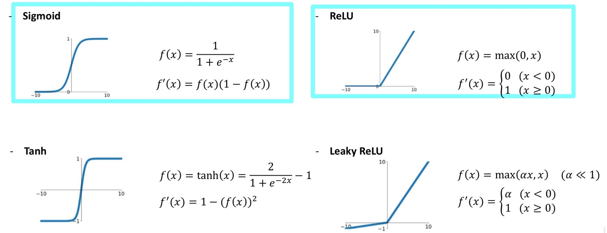
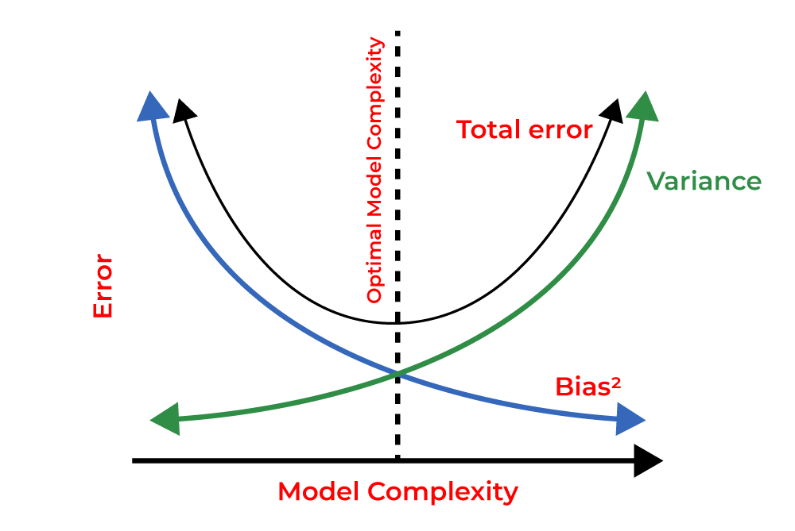
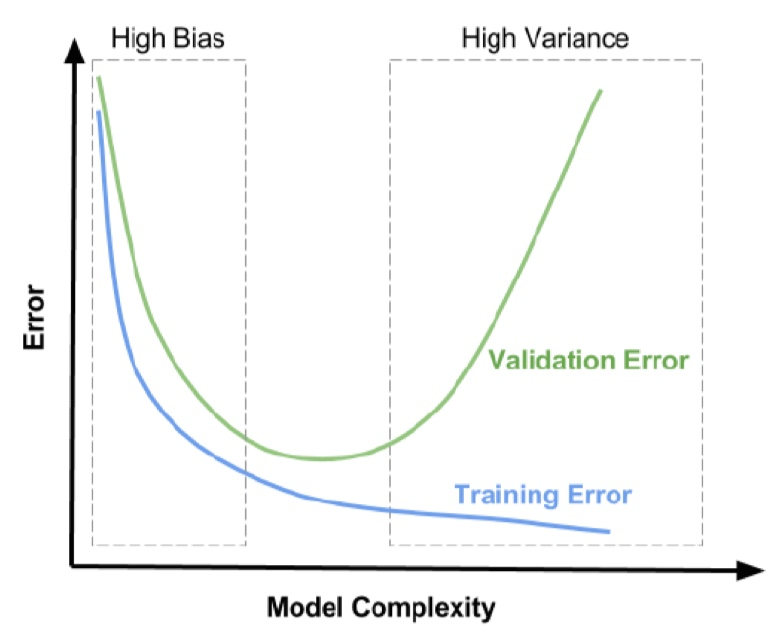
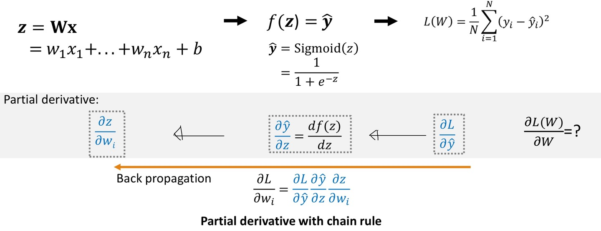
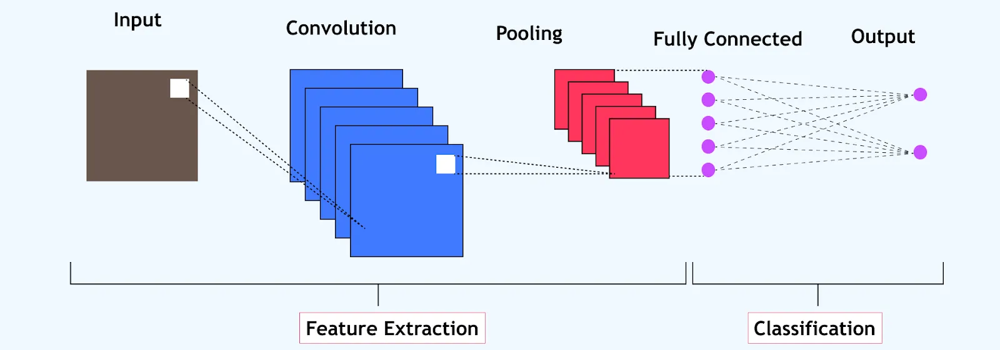
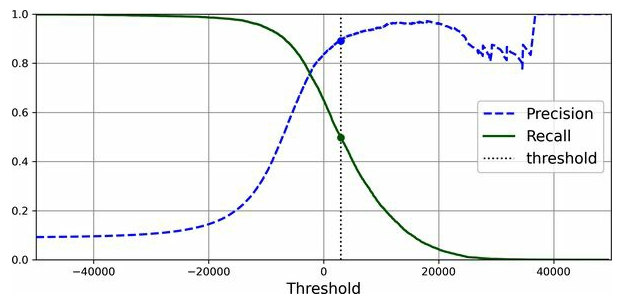
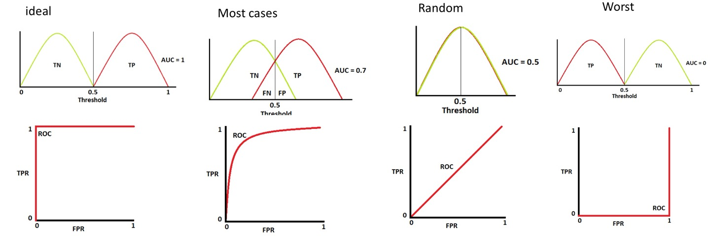
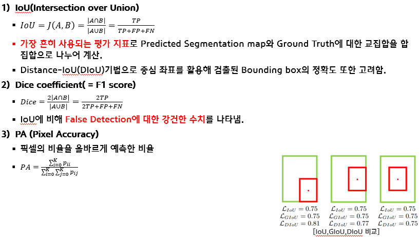
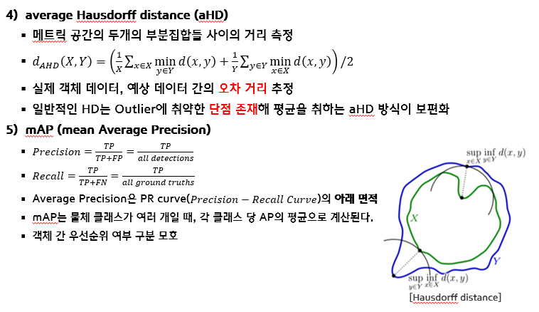
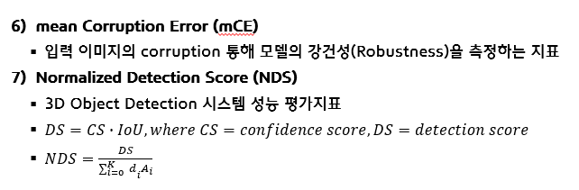

# Deep Learning
### DL and ML
1. DL: finds and learns the characteristics of learning data by itself
   1. Object detection
   2. Semantic segmentation
   3. Pose estimation
   4. Anomaly detection
   5. 다음과 같은 분류로 나눌 수 있다.
   - ANN
   - DNN
   - CNN
2. ML: need manual feature extraction/selection for the model
   1. Supervised
   2. Unsupervised (Clustering이 대표적인 예)
   3. Semi-supervised
   4. Reinforcement (강화학습)
## Theory
### Perceptron
   1. Binary linear classifier
   $$z= w^Tx + b, x: input, w: weight, b: bias $$
   2. Decision boundary $$y = 0 \ if \ \ z<= 0 \ else  \ 1$$
   3. Linear Decision Boundary $\rightarrow$ Activation Function(Step) $\rightarrow$ Classification

### MLP/Forward Network
   1. MLP: Multi-Layer Perceptron
      1. Started from XOR gate (Linear Decision boundary is not suitable for XOR gate boundary)
      2. XOR gate can be splitted into $$y = (x_{1}x_{2})'(x_{1}+x_{2}) = AND(NAND(x_{1},x_{2}),OR(x_{1},x_{2}))$$
      3. MLP: Non-linear classifier / Also use non-linear activation function (ReLU, tanh, sigmoid)
   2. Forward Network 
      1. The structure and operation of traditional neural networks where data moves in one direction—from input to output.

### Activation functions
   What is activation function?   

   - Transform input signal of a node in a neural network into an output signal that is then passed on to the next layer.
   - Without activation function, neural networks would be restricted to modeling only linear relationships between I/O. e.g. Matrix multiplication
   - Enables networks to learn **non-linear relationships by introducing non-linear behaviors** through activation functions. Thus, increases flexibility and power of neural networks to model complex data
   - Activating neurons ensures that **backpropagation works effectively**, as these functions influence the calculated gradients during training. Thus, gradient descent optimization.
   - **Decision boundaries**: Help define complex decision boundaries.

   Why gradient of activation function important?

   - Crucial role in **training** process
   - **Weight update** using derivatives
   - **Learning signal** direction & magnitude of the updates
   - **Gradient flow**

       
[참고](https://lynnshin.tistory.com/8?category=919376)        
**Types of activation functions**   

   1. Sigmoid: output limit [0,1]
      - vanishing gradient
      - not zero centered
      - not used in practice
      - sigmoid is used in logistic regression
      - simple gradient function

   2. tanh
      - vanishing gradient

   3. ReLU: Rectified linear Unit
      - Not zero centered

### Loss functions

   - Minimize classification/ regression error
   - Avoid over-fitting in training

   

   - Loss function calculates error between prediction and ground truth
   - Average error from all datasets

   

   - Common loss functions
     - Mean Squared Error(MSE): used for regression tasks, calculates average squared difference between predicted and actual values
     - Binary cross-entropy: Binary classification problems, it measures the difference between two probability distributions
     - Categorical **cross entropy**: multi-class classification problems, it extends binary cross-entropy to handle multiple classes
     
     **Cross entropy**
     
     - model predicts a probability distribution across multiple classes
     
     $$\text{Categorical Cross-Entropy} = -\sum_{i=1}^{C} y_i \log(p_i)$$ 
     
     - **Probabilistic Interpretation**: Cross-entropy provides a measure based on probabilities, making it suitable for models that output probabilities (like those using the softmax function in multi-class problems or the sigmoid function in binary cases).
     - **Gradient Descent Optimization**: It works well with gradient-based optimization algorithms, providing smooth gradients that lead to effective weight updates during training.
     - **Sensitivity**: Cross-entropy is sensitive to misclassification. It penalizes wrong predictions heavily, especially when the model is confident about its incorrect predictions (e.g., predicting a probability close to 1 for the wrong class).
     - **Encourages Higher Confidence**: By minimizing cross-entropy, models are encouraged to assign high probabilities to true classes while assigning low probabilities to false classes, thereby improving overall classification performance.

   - **Regularization**

     Regularization is a technique used in machine learning and neural networks to **prevent overfitting**, which occurs when a model learns the training data too well and performs poorly on unseen data. Regularization introduces additional information or constraints on the model to ensure that it generalizes better to new data. Here are some common regularization techniques

     **Promotes Simplicity**: Encourages simpler models with fewer complex relationships, which are often more interpretable and robust.

     - Curse of dimensionality (Interpolation과 같은 상황에서 실제 경향보다 차수가 훨씬 높을 때, 발생하는 문제)

       - Overfitting: high model complexity/ high variance
       - Underfitting: small datasets, over-generalizing/ high bias

     - L1 regularization
       - Adds the absolute value of the weights to the loss function as a penalty term. 
       - tendency to produce sparse weights
     - L2 regularization
       - Adds the square of the weights to the loss function produce small weights.
       - L2 regularization is fine with SGD, momentum optimization, and Nesterov momentum optimization, but not with Adam and its variants.
       - To use Adam with weight decay, then use AdamW instead
     - Dropout
       - A technique where a random subset of neurons is "dropped out" (set to zero) during each training iteration. This prevents the model from becoming overly reliant on any specific set of features. 
       - It effectively creates a different architecture for each training iteration, helping to improve generalization. 
       - Since dropout is only active during training, comparing the training loss and the validation loss can be misleading.  
       - Large network는 overfit에 취약하다. 따라서 training 도중, network의 random node deactivation를 일부러 시켜서 남은 노드들의 영향력을 확인할 수 있다.
     - Early stopping
       - A form of regularization that involves monitoring the validation loss during training. 
       - When the validation loss starts to increase after initially decreasing, training is stopped to prevent overfitting.
     - Data augmentation

       - Generating additional training data through various transformations of the existing data (e.g., rotations, translations, scaling for images)
       - 사진이면 돌려도 보고, 키워도 보고, 위치도 바꿔보고 등등 짜집어서 실제 test 혹은 validation에서 강인한 인지를 할 수 있게 만드는 기술이다.
       - It artificially increases the size and diversity of the training set, helping the model learn more robust features

     - **Batch normalization**
       Although primarily used to speed up training and improve convergence, batch normalization can also have a regularizing effect by adding some noise to the inputs of each layer during training
       
       Complex and deep layers have tendency to have vanishing gradient problem (Layers near input remains relatively unchanged)
       
       Explosive gradient: larger error gradients sequentially accumulate causing unstable update

   - **Batch**
     - Dividing the whole dataset into number, 데이터셋의 일부
     - Iteration 당 사용되는 양
     - 전체 데이터셋을 한번에 처리하는 것이 아닌 부분 부분으로 나눠 관리 가능한 크기로 처리함
     - Instead of using the entire dataset to compute the gradients for weight updates during training, which can be computationally expensive and inefficient, the dataset is divided into smaller, manageable sections, or batches.
     - Common batch sizes can range from 1 (in stochastic gradient descent, where each sample is processed individually) to larger sizes such as 32, 64, 128, or 256, depending on the dataset and available **computational resources**
     - **훈련 과정**: 훈련 시 일반적으로 다음과 같은 단계가 진행된다:
       - 일정량의 입력 데이터를 포함하는 배치가 모델에 입력된다.
       - 모델은 해당 입력을 기반으로 예측을 수행된다.
       - 손실 함수가 예측값과 실제 라벨 간의 오류를 계산된다.
       - 손실에 대한 모델 파라미터의 그래디언트(기울기)가 계산된다.
       - 이 그래디언트를 사용하여 모델의 파라미터(가중치)가 업데이트된다. 일반적으로 경량 하강법(stochastic gradient descent)과 같은 최적화 알고리즘을 사용한다.
     - Large batch = larger learning rate
     - Small batch = small learning rate 
     - Usually, small batch size perform better
   - Gradient Descent
     - **전체 배치 경량법(Batch Gradient Descent)**: 전체 데이터셋을 이용해 그래디언트를 계산. 대규모 데이터셋에서는 느리고 메모리 집약적
     - **확률적 경량 하강법(Stochastic Gradient Descent, SGD)**: 배치 크기로 1을 사용하여 각 개별 샘플에 대해 가중치를 업데이트. 잡음이 더 많으나, 더 자주 업데이트하기 때문에 빠른 속도 제공
     - **미니배치 경량 하강법(Mini-Batch Gradient Descent)**: 소규모 고정 배치(예: 32 또는 64 샘플)를 사용하여 가중치를 업데이트. 일반적인 방식으로, 전체 배치와 확률적 경량 하강법의 장점을 결합.

### Backpropagation
   [Video for backpropagation 1](https://www.youtube.com/watch?v=Ilg3gGewQ5U&t=11s)     
   [Video for backpropagation 2](https://www.youtube.com/watch?v=tIeHLnjs5U8)   
     

### Optimization

   - Finding optimal $$W$$ that minimizes loss function $$L(W)$$
   - Gradient descent: follows opposite gradient of loss function
     - update parameter W until it reaches the minima
     - control step rate(learning rate)
     - $$W_{k+1} = W_{k}- \eta {\partial L(W)\over\partial W}$$
   - Examples of gradient descent methods
     - SGD(Stochastic gradient descent)
     - mini-batch gradient descent
     - adagrad: achieves this correction by scaling down the gradient vector along the steepest dimension. runs the risk of slowing down a bit too fast and never converging to the global optimum
     - momentum
     - Nesterov Accelerated Gradient
     - RMSProp: 최근 iteration에서의 gradient를 쌓아서 adagrad보다 안정적인 optimizer
     - Adam(adaptive moment estimation): Momentum optimizer + RMSProp
     - AdaMax
   - Issues
     - Convergence: there may be multiple minima
       - depending on initial value, learning rate
     - How to calculate the gradient of loss function?
       - Use **backpropagation**

### Convolution
Convolutional Neural Network(CNN)은 MLP를 좀 더 효과/효율적으로 운용할 수 있는 신경망이다. 주로 이미지에서 사용하는 기법이다.    
MLP의 한계:
- 너무 많은 파라미터, 훈련 시간/비용 연산량 등
- (data augmentation이 없는 경우) 확대/ 이동/ 회전 등에 취약

Convolution은 사실 신호 및 시스템에서 배운 내용과 겹치는/다른 내용이 있다. (신호 및 시스템의 Correlation과 유사하다.)     
영상 처리 기법에서 Spatial Filter에 대한 내용과 유사하다. 2차원 이미지가 있을 때, 필터의 픽셀 요소와 이미지의 픽셀 별 곱(2차원 요소별 곱셈)을 취하고, 이에 대한 연산 값이 Anchor point가 위치한 곳의 값  
필터의 윈도우 사이즈에 따라서, Padding과 Stride가 필요로 한다.  
Padding과 Stride [참고](https://amber-chaeeunk.tistory.com/24)
- **Padding**: 이미지의 완전 끄트머리에 있는 픽셀 계산을 할 때, 차원 소실을 방지하기 위해 막을 하나 입힌다고 생각하면 이해하기가 쉽다. Stride가 1인 경우, Filter size가 홀수(홀수가 아니면 이상하다)인 경우, $$\text{Padding} = {\text{Filter Size}-1\over2}$$
- **Stride**: Filter Window의 Anchor point가 Image의 픽셀 좌표계에서 몇 칸씩 움직이면서 연산을 수행할 것인지
#### Pooling Layer
[Pooling Layer 참고](https://amber-chaeeunk.tistory.com/25)
- Downsampling하는 기법
- Max pooling/ average pooling 등이 주로 쓰임
- e.g. 4*4 matrix에서 연산을 수행할 경우, 2*2로 (다운샘플)낮춰주는 효과가 있다. 연산량이 줄어들 뿐 아니라, Feature extraction을 할 수 있다.
- Max pooling처럼 가장 값이 높은 값으로 대체하는 비선형 필터링을 거치며, padding 없고, stride도 1이 아닌 다른 숫자가 올 수도 있다.
- **Depth는 변하지 않는다**.(중요!)
- 다운 샘플링을 통해서 위치의 변화/Feature의 변화에 더 강인한 특성을 갖는다.

#### Fully Connected Layer
- 입력: 3차원 픽셀 이미지에서 Convolution, pooling 등을 거쳐 Tensor에서 평탄화(Flatten)된 1차원 벡터 
- Hidden layer: MLP
- Output: m개의 분류를 위한 m개의 노드
- CNN layer를 거쳐 Feature extraction을 수행한 후, 이를 분류하기 위한 작업으로 표현된다(다음 사진 참고)
  

### Performance metrics/ Evaluation
딥러닝 모델의 성능에 대한 평가 지표를 나타낼 때 가장 많이 쓰이는 방법을 다룬다.
#### Confusion matrix 혼동행렬
딥러닝 모델의 예측/Prediction이 얼마나 정확한지에 대해 판단할 수 있는 표
True Positive/True Negative vs Predicted positive/Predicted negative로 표현한다.     
혼동행렬을 통하여, 아래와 같은 평가 지표를 산출할 수 있다.
#### Accuracy
전체 데이터셋에서 모델이 얼마나 정확하게 분류를 해내었는지,      
즉 예측한 데이터 중 실제로 정답인 경우 (TP, TN)를 전체 데이터 셋으로 나눈 값이 Accuracy로 표현된다.   
$$\text{Accuracy} ={TP+TN \over TP+FN+TN+FN}$$ 
#### Recall
실제 Positive 중, 모델이 Positive로 분류한 비율     
재현도, 민감도 등으로 불린다. recall/ sensitivity/ true positive rate(TPR)    
$$\text{Recall} ={TP \over TP+FN}$$ 
 
#### Precision
Positive로 예측/분류한 것 중 실제 값이 positive인 비율     
the accuracy of the positive predictions
$$\text{Precision} ={TP\over TP+FP}$$

#### The Precision/Recall Trade-off
Recall과 Precision은 Trade-off 관계     
    
Recall만 보는 것/ Precision만 보는 것은 바람직하지 않은 방식이다.   
따라서 Threshold를 수정하여 뭐에 더 초점을 둬야하는 모델인지 생각해보자.   
e.g. threshold가 높다면, precision은 증가하나 recall은 감소한다. Detect하기가 빡빡해진다. 반대로 threshold가 낮다면, 비슷한 거도 True로 predict한다.          
카메라를 통한 보행자 검출을 생각해본다면, 더 안전한 것은 아마 recall이 높은 것일 거다. 최소한 보행자를 실제로 치는 경우를 낮춰야하기 때문에...  
#### F1 Score
Precision, Recall Trade-off로 인하여 개인적으로 가장 합리적인 평가지표라고 생각한다.  
Precision, Recall의 조화평균이다.  
Accuracy 외 F1 Score를 사용하는 이유는 데이터의 불균형 때문이라고 한다.
$$\text{F1-Score} ={2*\text{Precision}* \text{Recall}\over \text{Precision} + \text{Recall}}$$
다중 class 분석을 할 경우, 복잡해질 것 같지만, Macro F1 score, Micro F1 score, weighted F1 score 등이 있으므로 [참고](https://data-minggeul.tistory.com/11)하면 될 것 같다.     
#### ROC, AUC
ROC: Receiver Operating Characteristic curve    
AUC: Area under the curve
이진 분류를 할 때, Threshold에 따른 실제 값 예측 성공/실패를 나누는 그래프    
AUC가 1에 가까울 수록, 정확한 분류를 한다는 의미를 갖는다. 그냥 100번의 분류 중 50번만 맞추는 분류기가 있다면, ROC AUC는 0.5일 것이다.
Specificity라는 지표가 있다.
$$\text{Specificity} ={TN\over TN+FP}$$     
FPR: False positive rate는
$$\text{FPR} ={FP\over TN+FP}$$ 혹은      
$$\text{FPR} =1- \text{Specificity}$$   
아래 그림에서 이진 분류에 대한 보편적인 예를 들 수 있겠다. Threshold로 분명하게 두 분류를 나눌 수 있는 어떠한 값이 있다면, ROC AUC는 100을 만족한다. 하지만, 실제 경우에는 노이즈, 모델 불확실성 등으로 인해 정확하게 나눌 수 있는 기법은 잘 없다. 이런 경우 ROC-AUC는 두번째 그래프와 같은 형상을 띈다.      
    

[참고1 AUC ROC](https://angeloyeo.github.io/2020/08/05/ROC.html#google_vignette)  
[참고2 AUC ROC](https://angeloyeo.github.io/2020/08/05/ROC.html)  

#### Etc
이외에 F Score, IoU, mAP 등 다양한 평가 방법이 있다.(아래에 발표 자료 만들때 정리해뒀던 자료 사진 참고)       
    
    
    

### Misc

1. **Iteration**:
   - An iteration refers to one update of the model’s parameters during training. It corresponds to the number of batches processed. For example, if you use a mini-batch gradient descent with a batch size of 32 and your training dataset contains 1,000 samples, you would have 31 iterations (with the last one possibly processing fewer samples if they don't evenly fit).
2. **Epoch**:
   - An epoch refers to one complete pass through the entire training dataset. During an epoch, the model sees and processes every training example once. For the same example above, with a dataset of 1,000 samples and a batch size of 32, it would take 31 iterations to complete one epoch.

**Deep Learning Training Process**

1. **Initialization**: 
   - Initialize model parameters (weights and biases) randomly or using specific initialization techniques.
2. **Epoch Loop**:
   - For each epoch:
     1. **Shuffling**: Shuffle the training data to promote a better learning pattern and avoid overfitting.
     2. Batch Loop:
        - For each batch of data within the epoch:
          1. **Forward Pass**: Input the batch into the model and compute predictions using the current weights.
          2. **Loss Calculation**: Compute the loss by comparing the predictions to the true labels using a loss function.
          3. **Backward Pass**: Perform backpropagation to calculate gradients of the loss with respect to model parameters.
          4. **Parameter Update**: Update the model parameters using an optimization algorithm (like SGD, Adam, etc.) based on the computed gradients.
     3. **End of Batch Loop**: At the end of all batches in the epoch, the model has seen all training samples once.
3. **Validation**:
   - After each epoch, evaluate the model on a validation dataset to monitor its performance and check for overfitting.
4. **Stopping Criterion**:
   - Repeat the epoch loop for a predetermined number of epochs or until a stopping criterion is met (like early stopping if validation performance is not improving).
5. **Final Model**: 
   - Once training is complete, save the final trained model for future use or inference.