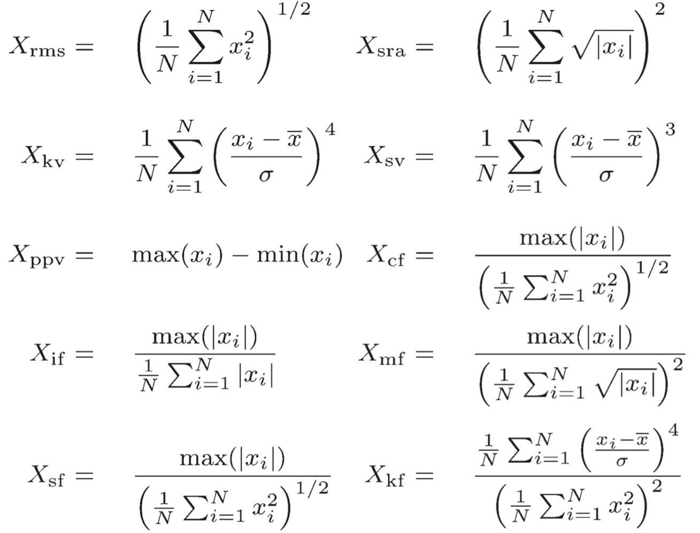
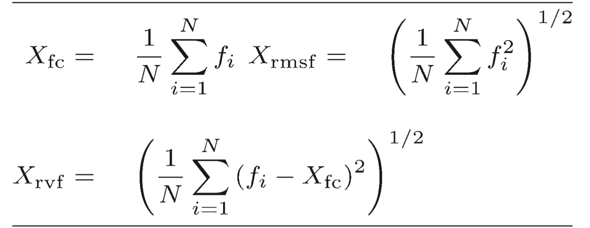

# Machine Learning
Some examples of machine learning techniques are posted in [Industrial AI and Automation repository](https://github.com/Kwak-Jin/IAIA/tree/master/Tutorial/TU_MachineLearning)  
Why Machine Learning?
- Dataset이 부족함/ 카메라의 경우 3차원 rgb 및 픽셀수로 인해서 딥러닝을 잘 활용할 수 있지만, 1차원 시계열 데이터는 딥러닝이 부적합할 수 있음
- 비용적인 측면
- 속도(실시간 성을 보장해야하거나, Training 시킬 시간 등)
    
### 어느 분야에서 Machine Learning이 쓰이는지
산업에서 Machine Learning은 자동화/분류/고장예지 및 건전성 관리 등 아주 광범위하게 쓰인다.     
해당 문서에서는 산업 기반/ 기계적인 역학 기반/ 센서 신호 처리 기반에 대해서 주로 다룰 것이다.     
1. 배터리 수명 예측
2. 코일
3. 기어-베어링 시스템
4. PCB 기판
5. LED 등
    
**Terminology** 
- Fault: Abnormal state of system
  - Mechanical: 변형, 피로 등
  - Electrical: 쇼트 등
  - 대부분(약 50%)의 산업 장비의 fault 및 failure는 회전기계/베어링에서 발생함
- Failure: Event from fault/ permanent interruption of system under standard operating condition
- Malfunction: temporary interrupt of system function
- Reliability: Ability to perform required functions for a certain period of time
  - MTTF: mean time to failure
  - lambda: rate of failure per time unit, MTTF 역수
- Safety: Ability not causing danger(Fault, failure, malfunctions)
- Availability: Probability the system will operate satisfactorily at any period of time

베어링의 고장 원인:
1. Flaking
2. Crack
3. Brinelling
4. Fretting
## Theory
### Preprocessing/데이터 전처리
데이터를 가공하기 쉽게 처리하기 위해서 전처리는 필수적이다. 산업의 경우 센서 등의 발달로 데이터를 뽑을 수 있으나, 노이즈, 이상치, 결측치 등 많은 에러사항이 있을 수 있다.   
Feature extraction의 원활한 진행을 위해 미리 전처리 과정을 거친다.    
[참고](https://chaheekwon.tistory.com/entry/%EB%8D%B0%EC%9D%B4%ED%84%B0-%EC%A0%84%EC%B2%98%EB%A6%AC%EC%9D%98-%EA%B0%9C%EB%85%90%EA%B3%BC-%EC%A4%91%EC%9A%94%EC%84%B1)
- Noise reduction
- Normalize (scaling)
- Outlier
- Missing value
- Offset removal
  - Missing value에 대한 처리는 조심해야하는 부분이 있다.
    - 뭐로 채울 것인지 
    - Interpolation 신뢰도 확인 
    - Sensor의 신뢰도 확인 
    - Sensor의 위치 확인 
- Filtering
  - Pass band 설정
  - Moving average(High variance data 날림)
- Time-Synchronous Average signal(TSA)
  - Remove noise, regular, residual signal

### Feature Extraction
Feature Extraction의 역할  
- Condition indicator
  - Several features ensenbled
- Signal based condition indicator
  - Features extracted using signal processing
    - Time domain
    - Frequency domain
    - Time-frequency domain(e.g. STFT)

**Feature extraction**
- 원본 데이터에서 얻기 힘든 어려운 의미있는 정보를 추출
- 원시 데이터의 패턴 이해
- 모델 성능 향샹 
- 계산 비용 감소
- 특징 추출
#### Time domain feature extraction
Time domain features(시간 영역)
- 시간적 변화를 직접 반영

시간 영역 **통계적 특징**
- Mean: 신호의 평균 
  - 전체적인 수준을 나타냄
  - 데이터의 중심 경향에 대한 이해
- RMS(root mean square): $$X_{rms}= \sqrt{{1\over N} \sum x_{i}^2}$$
- SRA(square root of the amplitude): $$X_{sra}= ({1\over N} \sum \sqrt{|x_{i}|})^2$$
- Min and Max value:
  - 데이터의 범위에 대한 이해
  - 피크 혹은 이상치 탐지에 유용
- Standard deviation 표준 편차:
  - 데이터의 분포가 평균으로부터 얼마나 퍼져있는지
  - 변동성 및 신호의 불규칙성 평가
- Variance 분산:
  - 데이터의 변동성
- Skewness 첨도:
  - 3rd standardized moment
  - 데이터의 비대칭성을 측정
  - 어느 방향으로 길게 늘어져있는지를 나타냄
  - $$X_{sv} = {1\over N}\sum ({x_i - \bar x\over \sigma})^3$$
- Kurtosis 왜도:
  - 4th standardized moment
  - determines the heaviness of distribution tails
  - 데이터 분포의 뾰족한 정도를 나타냄
  - 큰 값은 극단적인 값(Outliers)가 많다는 것을 의미
  - Degree of presence of outliers in the distribution
  - $$X_{kv} = {1\over N}\sum ({x_i - \bar x\over \sigma})^4$$
- PPV(peak-to-peak value):
  - 신호의 최고점을 찾고 이들 사이의 거리를 측정
  - $$X_{ppv}=max(x)-min(x)$$
- CF(Crest factor): 
  - $$X_{cf} = {\max(|x_i|)\over X_{rms}}$$ 
  - 신호의 피크가 얼마나 큰지
  - 피크가 얼마나 강조되는지
  - CF가 높을수록 신호의 강한 피크가 많다는 것을 의미
- IF(Impulse factor):
  - $$X_{if} = {\max(|x_i|) \over \text{Mean Value}}$$
  - 최대 진폭과 평균값의 비율
  - 급격한 변화의 존재에 대한 평가
  - 높을 수록 임펄스가 많다는 의미
  - 극단적인 변동성 분석
- MF(Margin factor):
  - $$\text{Margin Factor} = {\text{RMS Value}\over \text{Mean Value}}$$
  - 상대적인 안정성
  - 높을수록, 일관된 패턴을 가질 가능성 높음
- SF(Shape factor)
- KF(Kurtosis factor)
    

**Quality/characteristic of signal** 

- SNR (Signal to Noise Ratio)
  - Ratio of signal power and background noise ratio
  - important metric in assessing the quality of a signal
  - $$\text{SNR} = 10 \log_{10}({P_{\text{signal}}\over P_{\text{noise}}}) \text{where} ( P_{\text{signal}} ) \text{ is the power of the signal and} ( P_{\text{noise}})$$
  - A higher SNR indicates a clearer signal with less interference from noise
  - expressed in dB scale
- THD (Total Harmonic Distortion)
  - quantifies the distortion by nonlinear properties
  - compares the power of all harmonic components to the power of the fundamental frequency
  - $$\text{THD} = 10 \log_{10}({P_{\text{harmonics}}\over P_{\text{fundamental}}})$$ where, $$P_{\text{harmonics}}$$ is the total power of harmonic frequencies
  - Lower THD values indicate better signal fidelity
  - the output closely resembles the input without significant distortion
- SINAD (Signal to Noise and Distortion Ratio)
  - the effects of both noise and distortion on the signal
  - provides a more complete picture of signal quality than SNR alone
  - $$\text{SINAD} = 10 \log_{10}({P_{\text{signal}}\over P_{\text{noise}} + P_{\text{distortion}}})$$
  - higher SINAD indicates a better quality signal
  - crucial in applications such as audio processing

#### Frequency domain feature extraction
**푸리에 변환**을 통해 주파수 영역으로 변환을 거침    
[Go to 신호처리](https://github.com/Kwak-Jin/Artificial-Intelligence/blob/master/Theories/SignalProcessing.md)
- 주파수 구성 요소 분석
- 스펙트럼 분석  
- Power Spectral Density (PSD)
  - Measures the power of a signal’s frequency components, helping to identify how power is distributed over different frequencies
- Spectrogram
  - Provides a visual representation of the signal frequency as it varies with time.
- Bandwidth
- Peaks
- Total Harmonic Distortion
    

#### Time-Frequency Feature
시간에 따라 시스템의 대역폭이 달라질 수도 있고 고장이나면 다른 주파수가 관측될 수 있다. 다만 일반적인 주파수 분석으로는 시간에 대한 분석이 없기 때문에 다음과 같은 기법을 사용할 수 있다.   
일반적으로 3차원 그래프로 표시된다. (e.g. x축: 시간, y축: 주파수, z축: 해당 주파수 성분의 크기)  

##### Short Time Fourier Transform(STFT)
시간(구간)별로 어떤 주파수 성분이 있는지 나타낸다.
- 구간 별로 신호를 끊어 FFT를 수행한다.(Framing)
- 구간 별로 끊어서 관찰하게 된다면, 다른 주파수 성분을 포함할 수 있다. (e.g. 1번째와 n번째의 신호가 discontinous하기 때문에)
- 따라서 Windowing을 통하여 어느정도 Continuous한 형태로 변환해야할 필요가 있다.
- Hamming, Hanning 등 윈도우 기법이 상당수 존재한다.
- 개인적인 생각으로 구간이 나눠져있다면 $$|sin({2\pi\times\over T}\times t)|$$를 곱해주기만 하면 될줄 알았는데 여러 문제(신호의 Power 등)가 있어서 이런저런 윈도우 기법이 존재하는 것 같다.
- [링크 1](https://paeton.tistory.com/entry/Window-Function%EC%9D%84-%EC%93%B0%EB%8A%94-%EC%9D%B4%EC%9C%A0)
- [링크 2](https://m.blog.naver.com/PostView.naver?isHttpsRedirect=true&blogId=lecroykorea&logNo=221549211257)
- [STFT](https://sanghyu.tistory.com/37)를 통해 시간에 따라 어떻게 주파수 성분이 바뀌는지 볼 수 있다.
- Spectogram으로 표현할 수 있다. 이는 MATLAB 함수 `get_stft()` 함수를 참고해보도록 하자

##### Spectral Kurtosis

##### Spectral Entropy

### Feature Selection/ Feature reduction
#### Principal component analysis (PCA)

#### Other dimension reduction technique
##### Locally Linear Embedding(LLE)
##### Multidimensional scaling(MDS)
##### Linear discriminant analysis(LDA)

### Machine Learning models
#### Support Vector Machine (SVM)
#### Decision Trees
#### Ensemble method and Random forest

### Fault Diagnosis

### Fault Prediction

